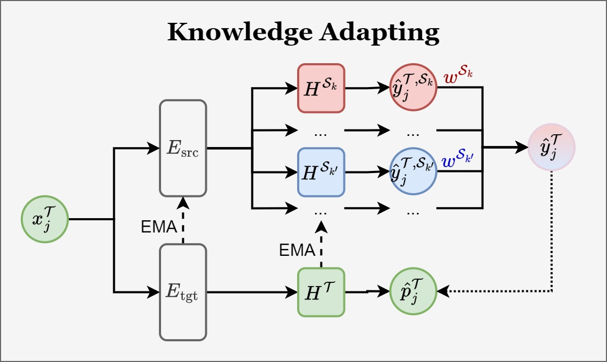

# Mitosis Detection in Rare Cancers: a Novel GIST Dataset and a Multi-Source Domain Adaptation Approach

GIST dataset: [[Download]](https://drive.google.com/file/d/1XX4aMiKO94_SiwLv5QaH6zcQscBAb_kI/view)

Checkpoints: [[Teacher]](https://drive.google.com/file/d/1c-TsXJmOQtZOgFh5_b0_skHNQa1hloBD/view) [[Student]](https://drive.google.com/file/d/1c-TsXJmOQtZOgFh5_b0_skHNQa1hloBD/view)

## Highlights

### Multi-Source Domain Adaption (MSDA)

- Building a new dataset for mitosis detection is ***HEAVY!***
- There are plenty of ***PUBLIC DATASETS*** for common cancers
- Utilizng these public datasets directly will cause ***DOMAIN SHIFT***
- ***MSDA*** bridges the gap between multiple source domains and target domain

### GIST Dataset

- Gastrointestinal stromal tumors (**GIST**) are ***RARE!***
- ***HUGE DOMAIN GAP*** among **GIST** and **MIDOG 2022**
- GIST serves as ***BENCHMARK DATASET*** for MSDA mitosis detection

### Knowledge Decoupling

#### Combining vs. Decoupling

- ***Combining*** source domains will cause **interference**, learning **task-irrelevant inter-domain** knowledge.
- ***Decoupling*** source domains will focus on unique characteristics of each source domain, learning **task-relevant intra-domain** knowledge.

#### Overview

- Each source domain $\mathcal S_k$ is linked to a **specific** detection head $H^{\mathcal S_k}$
- Gradients from the **corresponding** source domain $\mathcal S_k$ are used **normally**
- Gradients from **non-corresponding** source domains $\mathcal S_{k'}$ are ***REVERSED*** using a Gradient Reversal Layer (GRL)

### Domain Relevance Explortion

- A ***DYNAMIC*** weighting mechanism to combine outputs from multiple detection heads
- Weights are assigned based on their ***RELEVANCE*** to the target domain

### Knowledge Adapting

Here’s a concise summary of the content in a list format:

- Model is adapted to the target domain through a ***TEACHER-STUDENT*** manner.
- The predictions are aggregated to create **pseudo-labels** $\hat y^{\mathcal T}_j$
- An Exponential Moving Average (**EMA**) mechanism regulates the teacher detector's learning

### Results

#### Feature Adaption

#### Detection Results

| Method | F1 Score | Precision | Recall | TP | FP | FN |
|--------|----------|-----------|--------|----|----|----|
| MIDOG Baseline | 0.5336 | 0.8295 | 0.3933 | 798 | 164 | 1231 |
| FMDet | 0.4755 | 0.7696 | 0.3440 | 698 | 209 | 1331 |
| **MS-Mitosis** | **0.6841** | **0.7074** | **0.6624** | **1344** | **556** | **685** |